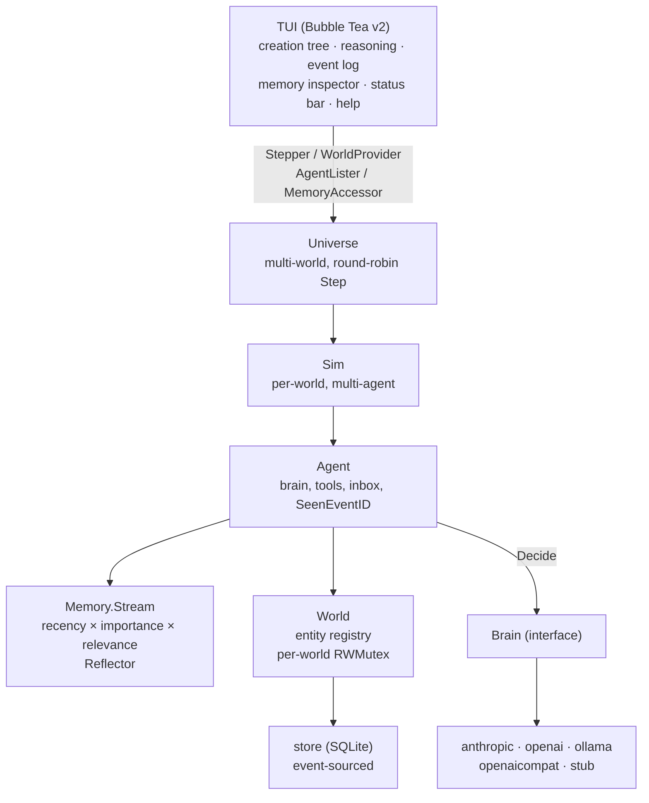
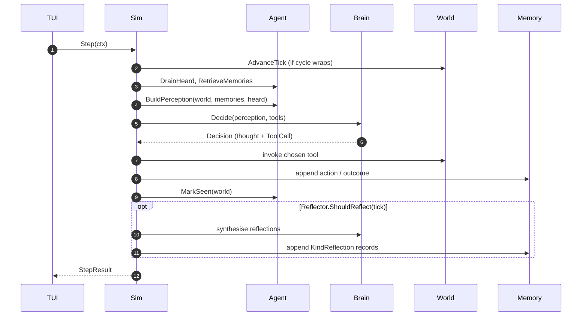
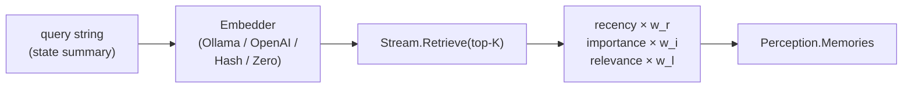

# Architecture

The cognitive architecture — memory stream, recency × importance ×
relevance retrieval, periodic reflection — comes directly from Park
et al.'s *Generative Agents: Interactive Simulacra of Human Behavior*
(Stanford, 2023). fiat-lux discards Smallville's town, map, and fixed
cast and keeps only the cognition, pointed at a void.

## System layers

## Per-tick loop

## Tool vocabulary

| Tool             | Effect                                                                 |
| ---------------- | ---------------------------------------------------------------------- |
| `Create`         | Bring a new entity into being. type_label + properties are free-form.  |
| `Modify`         | RFC 7396 JSON merge patch on an entity's properties.                   |
| `Destroy`        | Soft-delete; relationships referencing it cascade-soft-delete.         |
| `Relate`         | Declare a relationship with an agent-chosen kind string.               |
| `Unrelate`       | Soft-delete a relationship.                                            |
| `Observe`        | Survey the world; filter by type_label. Returns a short summary.       |
| `Reflect`        | Write a high-importance memory; no world mutation.                     |
| `SpawnAgent`     | Create an agent-entity with its own brain, system prompt, granted tools. |
| `Speak`          | Broadcast to other agents; recipients see it as `Heard` next tick.      |
| `Wait`           | Skip n ticks.                                                          |
| `FindByType`     | Read-only. List live entities whose type matches. Returns structured JSON. |
| `FindByProperty` | Read-only. List live entities where properties[key] matches a value.   |
| `FindRelated`    | Read-only. List entities related to entity_id, optionally by relation kind. |
| `Zoom`           | Pin focus on an entity for N turns; perception adds a `focus` sub-tree. |
| `Unzoom`         | Release the current focus before its turns expire.                     |

## Containment, focus, and the frontier

"Contains" is a soft convention: a relationship whose `Kind` matches
`"contains"` (case-insensitive) means the `To` entity is inside the
`From` entity. The engine still does not interpret any type label or
kind — but it uses this one convention to shape what the agent sees.
Each `BuildPerception` walks the `contains` graph to derive:

- `Frontier.Leaves` — parented entities with no children of their own,
  surfacing where the world can be deepened.
- `Frontier.DeepestPath` — one chain from a containment root down to
  the deepest leaf.
- `Focus` (when set by `Zoom`) — a depth-first sub-tree of the pinned
  entity, capped at 64 nodes. Auto-expires after the requested turns.
- `Suggestions` — entities that have grown past `frontierChildSpawnThreshold`
  children, surfaced as candidates for a place-scoped `SpawnAgent`.
  The engine never spawns; the LLM decides.

## Event sourcing

Every world mutation appends to the event log. The SQLite store
persists only worlds and events; live state (entities, relationships)
is derived by replaying the log. That makes save/load and `replay`
trivial — and exact, because brain decisions are reduced to the world
events they emitted.

## Memory retrieval

Recency is exponential decay with a configurable half-life (default
100 ticks). Importance is heuristic by default (kind + length signals
on a 0..10 scale); the LLM scorer is opt-in via `--importance=llm`.
Relevance is cosine similarity between the query embedding and each
record's embedding; with `ZeroEmbedder` (default) relevance contributes
nothing and retrieval falls back to recency × importance.

Reflections fire every N ticks: the most recent raw memories go to the
brain with empty tools; insights are parsed line by line and written
back as `KindReflection` records with a 7.5 importance floor.

## Brains

The `Brain` interface (`Decide`, `Model`, `Provider`, `Close`) is the
only LLM-shaped contract the sim depends on. Five implementations:

| Provider       | Default model              | Notes                                              |
| -------------- | -------------------------- | -------------------------------------------------- |
| `anthropic`    | `claude-haiku-4-5`         | Messages API, prompt caching on by default         |
| `openai`       | `gpt-5.4-nano`             | Chat Completions, function calling                 |
| `ollama`       | `qwen3:8b`                 | Local OpenAI-compatible `/v1`                      |
| `openaicompat` | (user-supplied)            | LM Studio, llama.cpp, vLLM, OpenRouter             |
| `stub`         | n/a                        | Weighted-random valid tool; free; used for tests   |

API keys come from environment only (`ANTHROPIC_API_KEY`,
`OPENAI_API_KEY`, `FIATLUX_OPENAICOMPAT_KEY`). They are never logged;
upstream error bodies are scrubbed of `sk-...` fragments before being
surfaced.

For older local models without reliable native tool calling, the
OpenAI-shaped client falls back to JSON-mode parsing: plain text
shaped like `{"tool":"<name>","args":{...}}` is lifted into a real
ToolCall.
